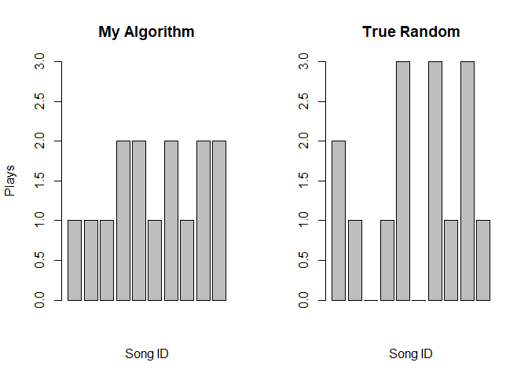
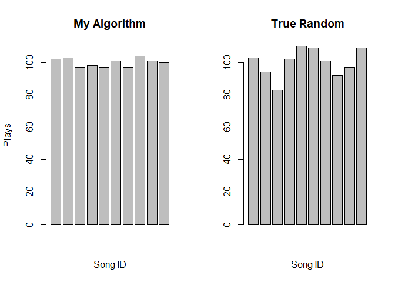
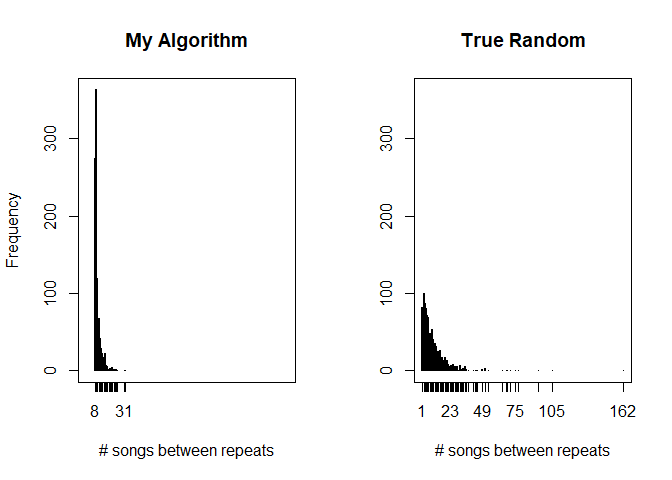
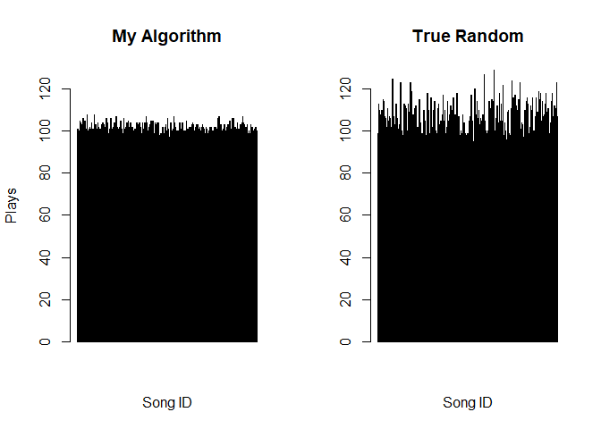
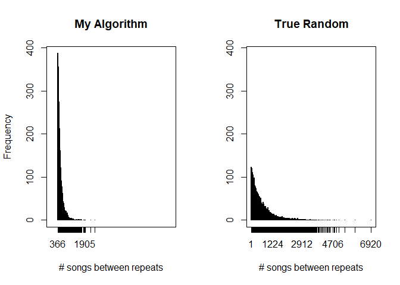

On Shuffle Play
================

### Intro

Despite many years of advances in music technology, with paradigms
shifting from physical media to digital, and from purchases to streams,
I still often find myself annoyed with one ubiquitous, and ostensibly
simple feature: the “shuffle” button. It remains somewhat typical, it
would seem, to choose the next song at (pseudo)random, without regard
for the ramifications of such a choice. To prove that this method is
lazy, and stupid, I spent a couple hours developing this project, which:

1.  (To the best of my understanding) mirrors our intuitive
    comprehension of randomness
2.  Does not strongly sacrifice the truth of that randomness

This project is written in R, which is neither particularly well-suited
nor efficient for the concept. But, I quite like it. In this proof of
concept, this is done w.l.o.g. Heck, it might add generality.

The main idea here is that the shuffling of music, or perhaps any
shuffling that deals with human perception (though exactly how is beyond
my area of expertise), cannot be handled without consideration for that
perception. Moreover, the consideration does not require much effort.

As far as the “intuitive comprehension of randomness” is concerned, I
again present a two-item list:

1.  Songs should not play again for a while after they have played (no
    repeats)
2.  Songs should play once in a while: as close to our expectation as
    possible (no songs that never play) \[the expectation here is the
    mean of the multinomial which describes the shuffled playlist,
    :
    you expect to hear a song
     once
    every time you cycle your playlist\]

-----

### Truncating Randomness

An easy method which satisfies the above is to create a soft buffer,
denoted as a recycle
bin, which prevents songs from being repeated for a certain period after
they have played. To describe this buffer, I use a simple uniform
distribution:

)

Where 
defines the beginning of the recycle bin, and
 the end
of the playlist (which is also the end of the bin).

I choose the uniform here because it is simple and inherent to the way
pseudorandom numbers are generated, and also because it is strictly
bounded at both ends. When our current song finishes, a realization of
this variable is then generated and rounded to decide its new place in
the queue.

It’s worth noting that, as R is a 1-indexed language, the typical “true
random” process can be
defined:

)

Which is not much different at all.

-----

### Choosing a Start

We already have something simple, and superior to a random shuffle. But,
as I insist these improvements are easy, we will continue. So far, we
have created a rigid buffer to help solve our playlist problem. That’s
good, but playlists are rather fluid, conceptually.

To reconcile, it follows that we need a fluid barrier. It should also
follow that shorter playlists will need to shuffle songs further back to
prevent the perception of repetition, and thus longer playlists will
have more freedom. To determine the proportional size of the buffer,
then, we need a function bounded between 0 and 1. Since playlist size,
, is itself
bounded at 1, we have a simple solution for our base
function:  
%7D)  
Which is equal to 0 at
, and
converges to 1 as
.
Nothing else about this equation is useful: for any other
, the size
of the buffer will be all but one song, preventing only immediate
repeats. I simply add a coefficient, called
randomness, to make
it more
sensible:  
%7D)  
For the coefficient, I use a default value of 0.05, which converges far
more reasonably. As the coefficient approaches 1 (or greater), it decays
quicker, closer approximating true randomness, hence the name. The
original function is equal to 0.5 when
. This
modified function will only equal 0.5 when
 is above 1
million, which playlists should seldom breach.

I also elected to add 2 parameters which perform roughly the same
function: buffer
(default 4), which sets an absolute minimum on the number of songs
between repeats, and
minRec (default
0.2), or “minimum recycle”, which sets the minimum proportion of the
playlist the recycle bin can shuffle into. Finally, the buffer must
occupy at least 1 position, to allow shuffling. Thus, the final buffer
size
equation:  
,%20n*max\(minRec,%201-e%5E%7B-randomness%20*%20ln\(n\)%7D\)\))  
The left maximum satisfies the
buffer condition,
and the right the
minRec condition.

-----

### Results

From here, operation is rather straightforward: when the playlist is set
up, we perform a true random shuffle to set initial order. Then, every
time a song ends, it’s cycled randomly into the buffer space.

I now compare the results to those of a true random shuffle, with
various playlist sizes, and numbers of plays.

First, we examine the results on a small playlist of 10 songs, with only
15 plays:

<!-- -->

Before the multinomial degenerates to the multivariate Gaussian, we
observe that my algorithm is superior at giving songs equal playtime. 2
of the 10 songs aren’t played in the true random realization, and 3 play
thrice. Neither event occurs under my algorithm.

Over 1,000 plays, we do see the expected convergence in distribution,
though my algorithm remains more consistent:

<!-- -->

But, this convergence hides an insidious, and were we actually listening
rather than simulating, obvious problem with the algorithm. Next, I plot
histograms of the number of songs between each repeat, (i.e. how many
songs until you hear the song that just played again) for the very same
simulations. A value of 1 means the song is played twice in a row, and
so on.

<!-- -->

We observe that for true randomness, the mode is 2, meaning a song plays
nearly back-to-back, and 1 (a direct repeat) is the third most common
figure. We also observe a maximum of 162, even with only 10 songs,
meaning some songs will very seldom be heard. My algorithm, with a mode
of 9 and maximum of 31, and furthermore, a minimum of 8, essentially
solves these issues. Under my algorithm, the probability of a song not
being heard for 162 plays is given as
, as
the bin size is 2 (hence 0.5), and it takes 9 songs to cycle from the
back of the bin to the front of the queue. A song must then be held up
153 times in a row. Clearly, such an event is practically impossible.

Intuitively, increasing the number of songs exacerbates this issue. Here
are the same plots for 500 songs, and 50,000
plays.

<!-- --><!-- -->

The maximum of 2,516 songs between repeats for my algorithm is perhaps a
bit concerning, and may indicate the utility of parameter tuning. Of
course, higher values are somewhat typical under true randomness.

-----

### Conclusion

Now that I have done the work, I can say with confidence that it’s
frustratingly easy to make a reasonable shuffle play algorithm. The
algorithm I’ve built, and again, built without any exceptional effort,
is far superior to a pure random shuffle. In the short term, and with
small playlists, where problems are most noticeable, it does a far
better job of distributing the music. And in the longer term, with
longer lists of music, it works to ensure all songs will recieve
reasonably regular play.

Moreover, this is managed without any remotely noticeable loss in
computational efficiency. (more on this in Appendix A)

In a phrase, there is no excuse for using true randomness in your
shuffle play.

-----

#### Appendix A: Efficiency

The algorithm, as built for this project, uses some abstractions that
will require further explanation, as pertains to efficiency. As
implemented, and as it should be implemented, the algorithm writes a
song “ID” for each element in the playlist. In dictionary or
dictionary-like constructs, which should usually be suitable for
playlist storage, this results in no loss. But, in the worst case, the
referencing and dereferencing adds operations in the order of linear
time.

The other “overhead” action, apparently the most complex, is the
generation of the buffer size. While a bit more complex, this process is
not repeated, and is of the order of constant time.

The final overhead bit is the first shuffle, which is truly random.
That’s of order n.

There may also be confusion over the repeated step of the process. The
only repeated process of the algorithm is the generation of the uniform
random variable, which is not much different than the process for a true
random shuffle. This repetition also occurs only when a song is played.
In any case, recycling a song into the queue is on the order of linear
time, as in a truly random process.

So, the verdict, as far as time complexity is concerned, is fine. There
is some negligible overhead we don’t observe in a true random process,
but the repetitive process is essentially the same.

Space complexity is certainly different, but again negligible on any
remotely modern architecture. This framework necessitates the storage of
an ordered list of songs, which is not strictly necessary for a true
random process. But, under proper construction, using the aforementioned
IDs, this is simply a list of integers. Negligible, for any plausible
amount of songs.

-----

#### Appendix B: Notes on Implementation

I will also briefly return to my offhand comments on R, where this is
coded. Attached to this project is an R package containing my algorithm.
With the abstractions, it can’t be used out-of-the-box for any song
shuffling, though it would be relatively easy to reappropriate its parts
to do so. Really, that’s beside the point. The package is provided
mostly for the sake of completeness.

Again, R is not the best workbench for this project. The central figure
of the process is a for loop - something R finds quite undesirable. But,
we cannot update playlists within a list comprehension without
destroying the fabric of that comprehension, so it is a necessity.

There is also the issue of array, or vector in R, versus list structure.
As implemented, with vectors, the vector is sorted every time there is
an update; a linear time operation. With a list, the onus moves to
searching for the entry to update, also a linear time operation, but a
different one indeed. The superior construct should depend on the tuning
of the parameters, though that is beyond the scope of this project.

Finally, I will again take note of those parameters. The chosen defaults
were selected purely on intuition, perhaps described better as instinct.
They are likely to vary by purpose, and also likely to have a better
tuning for general purposes. Again, that’s out of scope, and in a sense
outside my expertise.

As a last word, the R Markdown file that generated this readme is
included, with all code visible, for further examination.
